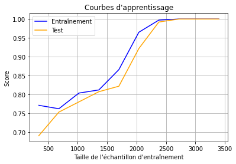
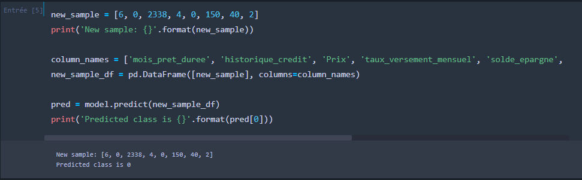
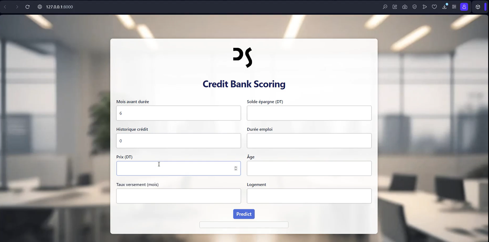

# 📈 Intelligent Credit Bank Scoring Classification System

## 📌 Project Overview
This project develops a **machine learning-based credit scoring system** to classify loan applicants as low-risk or high-risk using supervised classification models. It evaluates multiple algorithms on a local CSV dataset, selects the best performer (KNeighbors with 99% accuracy), deploys a real-time testing interface via **Django**, and visualizes data using **MongoDB** and **Power BI**. The system aids in automated credit decisions, reducing default risks.

---

## 📂 Dataset
- **Local CSV File**: Contains features like credit history, income, loan amount, and labels (e.g., approved/rejected).

---

## 🔍 Project Workflow

### **1. Data Loading and Exploration**
Load the dataset, handle missing values, and visualize distributions.

```python
import numpy as np
import pandas as pd
import matplotlib.pyplot as plt
import seaborn as sns
import missingno as msno

df = pd.read_csv('credit_data.csv')
msno.matrix(df)
plt.show()
sns.heatmap(df.corr(), annot=True)
plt.show()
```

### **2. Model Training and Evaluation**
Train and evaluate multiple classification models.

```python
from sklearn.model_selection import train_test_split, cross_val_predict
from sklearn.metrics import confusion_matrix, accuracy_score, recall_score, f1_score
from sklearn.linear_model import LogisticRegression
from sklearn.svm import SVC
from sklearn.neighbors import KNeighborsClassifier
from sklearn.ensemble import GradientBoostingClassifier, AdaBoostClassifier
from sklearn.preprocessing import LabelEncoder
import joblib

# Preprocess data (encode categorical features)
le = LabelEncoder()
df['categorical_col'] = le.fit_transform(df['categorical_col'])

X = df.drop('target', axis=1)
y = df['target']
X_train, X_test, y_train, y_test = train_test_split(X, y, test_size=0.2, random_state=42)

models = {
    "LogisticRegression": LogisticRegression(random_state=42, max_iter=10000),
    "SVM": SVC(random_state=42),
    "KNeighbors": KNeighborsClassifier(),
    "GradientBoosting": GradientBoostingClassifier(random_state=42),
    "AdaBoost": AdaBoostClassifier(random_state=42)
}

for name, model in models.items():
    model.fit(X_train, y_train)
    y_pred = model.predict(X_test)
    print(f"Model: {name}")
    print(f"Accuracy: {accuracy_score(y_test, y_pred):.2f}")
    print(f"Recall: {recall_score(y_test, y_pred):.2f}")
    print(f"F1 Score: {f1_score(y_test, y_pred):.2f}")
    print(f"Confusion Matrix:\n{confusion_matrix(y_test, y_pred)}")
    joblib.dump(model, f"{name}_model.pkl")
```

### **3. Django Interface for Real-Time Testing**
Deploy a web interface to test the model with user inputs.

```python
# In Django views.py (simplified)
from django.shortcuts import render
import joblib

model = joblib.load('KNeighbors_model.pkl')

def predict_credit(request):
    if request.method == 'POST':
        # Get form data, preprocess, predict
        prediction = model.predict(input_data)
        return render(request, 'result.html', {'prediction': prediction})
    return render(request, 'form.html')
```

### **4. Data Visualization with MongoDB and Power BI**
Store data in MongoDB and visualize in Power BI.

```bash
# Steps:
1. Install MongoDB and ODBC driver (https://www.devart.com/odbc/mongodb/download.html).
2. Create ODBC connection (localhost, database name).
3. In Power BI: Get Data > ODBC > Load database.
4. Create DAX columns: Score = [Feature1] * 0.4 + [Feature2] * 0.6, Class = IF([Score] > 0.5, "Approved", "Rejected").
5. Build dashboard with filters.
```

---

## 📊 Results
| Model              | Accuracy | Recall | F1 Score |  
|--------------------|----------|--------|----------|
| LogisticRegression | 0.72     | 0.72   | 0.66     |
| SVM                | 0.70     | 0.70   | 0.58     |
| KNeighbors         | 0.99     | 0.99   | 0.99     |
| GradientBoosting   | 0.86     | 0.86   | 0.85     |
| AdaBoost           | 0.77     | 0.77   | 0.76     |

- **Best Model Curve**:

  
  
- **Simple Test**:

   
  
- **Test Video**:

  [](model.mp4)
  
- **Power BI Dashboard**: See `final results/` folder for visualizations.

---

## 📦 Requirements
```bash
pip install numpy pandas matplotlib seaborn missingno scikit-learn joblib django
```

---

## ▶️ How to Run
1. Clone the repository:
   ```bash
   git clone https://github.com/ali27kh/Intelligent_Credit_Bank_Scoring_Classification_System.git
   ```
2. Create and activate virtual environment:
   ```bash
   python -m venv venv
   .\venv\Scripts\Activate
   ```
3. Install dependencies:
   ```bash
   pip install -r requirements.txt
   ```
4. Train models:
   ```bash
   python train_models.py
   ```
5. Run Django interface:
   ```bash
   python manage.py runserver
   ```
   Access at `http://127.0.0.1:8000/`.
6. For Power BI visualization: Follow MongoDB/Power BI setup steps and load data.

---

## 📌 Key Insights
- **KNeighbors** achieves the highest accuracy (99%), making it ideal for credit scoring.
- Feature correlation visualization aids in understanding risk factors.
- Django provides a user-friendly interface for real-time predictions.
- Power BI dashboards enable interactive analysis with DAX-based scoring.

---

## 📜 License
MIT License
